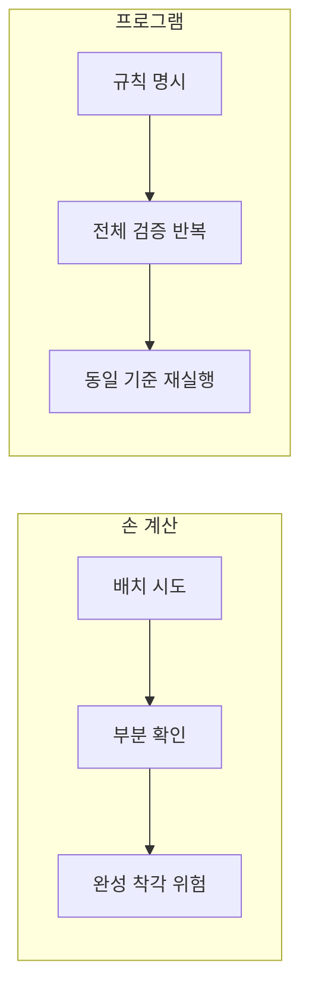

# 4x4 magic square problem definition
_Exported on 5/28/2026 at 14:03:09 GMT+9 from Cursor (3.5.38)_

---

**User**

당신은 문제 정의 전문가입니다.
나는 4x4 Magic Square 프로그램을 만들려고 합니다.
하지만 바로 설계하거나 구현하지 마십시오.
먼저 문제 인식 단계부터 진행하십시오.
--------------------------------------------
STEP 1 — Observation (관찰)
--------------------------------------------
다음 질문에 답하십시오:
1. 현재 우리가 해결하려는 상황은 무엇인가?
2. 왜 4x4 마방진 문제를 다루는가?
3. 이 문제는 어떤 학습 또는 시스템 설계 맥락에서 등장하는가?
“마방진을 만든다”는 표현 대신,상황을 관찰 관점으로 서술하십시오.


---

**Cursor**

프로젝트 맥락을 파악한 뒤 관찰 단계에 맞춰 답하겠습니다.


워크스페이스(`MagicSquare_30`)에는 아직 코드나 문서가 없습니다. 따라서 아래는 **프로젝트 이름과 요청만으로 읽을 수 있는 상황**을 관찰 관점으로 정리한 것입니다. 나중에 수업/과제 조건이 나오면 STEP 1을 다시 보정하면 됩니다.

---

## STEP 1 — Observation (관찰)

### 1. 현재 우리가 해결하려는 상황은 무엇인가?

**한 사람이 “4×4 격자에 1~16을 한 번씩 넣었을 때, 여러 줄·열·대각선의 합이 모두 같아지는 배치”를 다루는 상황**에 있습니다.

관찰로 풀면 이렇게 볼 수 있습니다.

- **입력/출력의 공백**: 손으로 채우면 시간이 걸리고, 놓치기 쉬운 조건(합 일치, 중복 없음)이 많다.
- **검증의 필요**: “맞는지”를 눈으로만 확인하기 어렵다. 행·열·대각선마다 합을 다시 더해야 한다.
- **탐색 공간**: 16칸에 1~16을 배치하는 경우의 수는 매우 크다. 그중 **합이 모두 같은 배치**는 극히 일부다.
- **프로그램의 역할(아직 미정)**: “한 가지 배치를 보여준다”, “사용자가 만든 배치를 검사한다”, “조건을 만족하는 배치를 찾는다” 등 **무엇을 자동화할지**는 아직 관찰 단계에서 열린 질문이다.

즉, 상황의 핵심은 **“16개의 서로 다른 수를 4×4 격자에 놓았을 때, 여러 방향의 합이 동시에 같아지는 구조를 어떻게 다룰 것인가”**이지, 아직 “앱을 만든다”는 단계는 아닙니다.

---

### 2. 왜 4×4 마방진 문제를 다루는가?

관찰상, 이 주제가 선택되는 이유는 보통 다음 층위에 겹칩니다.

| 층위 | 관찰 |
|------|------|
| **수학·퍼즐** | 작은 격자라 규칙(합=34 등)을 손으로도 추적할 수 있고, “모든 줄의 합이 같다”는 직관을 검증하기 좋다. |
| **알고리즘·구조** | 짝수 차수(4×4)는 홀수 차수(3×3)와 **만드는 방식·대칭·분할**이 달라, “크기에 따라 방법이 바뀐다”는 것을 경험하기 적당하다. |
| **프로그래밍 학습** | 2차원 배열, 반복, 조건 분기, 합 계산, 유효성 검사 등 **기초 제어 구조**를 한 문제에 묶어 연습하기 좋다. |
| **문제 정의 연습** | “마방진” 한 단어에 **생성 / 검증 / 힌트 / UI** 등 요구가 섞이기 쉬워, 지금처럼 **먼저 상황을 나누는 연습**에 쓰이기 좋다. |

폴더명 `MagicSquare_30`만으로는 **30일차 과제, 30번 문제, 30분 실습** 등 구체 이유는 확정할 수 없습니다. 다만 이름은 **“단순 계산기가 아니라, 정해진 학습·과제 맥락 안의 한 단원”**을 시사합니다.

---

### 3. 이 문제는 어떤 학습 또는 시스템 설계 맥락에서 등장하는가?

**학습 맥락**에서 자주 보이는 패턴:

- **자료구조 입문**: `4×4` 행렬 표현, 인덱스, 행/열/대각선 순회.
- **불변식·제약**: “합이 같다”, “1~16 각각 한 번” 같은 **제약을 코드로 표현**하는 연습.
- **알고리즘 입문**: 완전 탐색 vs 규칙 기반 생성(Siamese / 데울 등)의 **비용·정확성** 비교.
- **소프트웨어 공학 입문**: “생성기”와 “검증기”를 분리할지, 한 화면에 몰지 같은 **책임 분리** 논의의 소재.

**시스템 설계 맥락**으로 읽히면:

- **도메인**: 격자 퍼즐 + 산술 제약.
- **경계 후보**: (아직 미정) 사용자 입력 / 자동 생성 / 결과 출력 / 오류 메시지.
- **품질 속성**: 작은 n이라 **정확성**이 먼저, 성능은 보통 2순위.
- **확장 압력**: 나중에 3×3, 5×5, “사용자 정의 크기”로 키우면 **알고리즘·UI·검증 규칙**이 함께 커진다.

지금 단계에서는 **“4×4 마방진 프로그램”이라는 한 문장**이 아래 여러 **서로 다른 상황**을 한꺼번에 가리킬 수 있다는 점이 중요합니다.

- 교사/책이 준 **한 가지 정답 격자**를 출력하는 상황  
- 사용자가 채운 격자가 **조건을 만족하는지 판정**하는 상황  
- 조건을 만족하는 격자를 **찾거나 생성**하는 상황  
- 퍼즐처럼 **일부만 주고 나머지를 유도**하는 상황  

이들은 **같은 수학 주제, 다른 관찰 대상(상황)**입니다.

---

### “마방진을 만든다” 대신 — 관찰 관점 한 줄 요약

> **누군가(학습자·사용자·시스템)가 4×4 격자에 1부터 16까지를 배치할 때, 여러 방향의 합이 동시에 같아지는지 확인하거나, 그런 배치를 얻거나, 그 과정을 자동화·시각화하려는 상황**이며, 그 목적이 **수업 과제·알고리즘 연습·퍼즐 도구** 중 무엇인지는 아직 관찰만으로는 확정되지 않았다.

---

다음 단계(STEP 2 — Problem framing)로 가려면, 아래 중 **어떤 상황에 가장 가깝은지** 알려주시면 관찰을 좁힐 수 있습니다.

1. 정해진 마방진 **출력/표시**  
2. 사용자 입력 **검증**  
3. 조건 만족 배치 **생성/탐색**  
4. 수업/과제에서 **명시된 요구사항**(PDF, rubric 등)

설계·구현은 하지 않고, 답해 주신 방향만으로 STEP 2를 이어가겠습니다.

---

**User**

--------------------------------------------
STEP 2 — Why #1
--------------------------------------------
Q: 왜 마방진을 완성해야 하는가?
A를 가정하여 답하고, 그 답에서 드러나는 불편함 또는 구조적 문제를 분석하십시오.


---

**Cursor**

## STEP 2 — Why #1

### 가정한 답 (A)

**A:** “4×4 마방진을 완성해야 하는 이유는, **1부터 16까지를 격자에 배치했을 때 행·열·대각선의 합이 모두 같다는 조건을 스스로 만족시키고, 그 결과를 프로그램으로 검증할 수 있는지 확인하기 위해서**이다.”

즉, 목적은 **정답 격자 하나를 얻는 것**이라기보다, **제약(합 일치·중복 없음)을 이해하고 올바른 배치를 만들 수 있는지**를 학습·증명하는 것이다.

---

### A에서 드러나는 불편함

| 불편 | 관찰 |
|------|------|
| **합을 매번 손으로 확인** | 한 칸만 바꿔도 여러 줄·열·대각선의 합이 동시에 깨진다. 4×4라도 “맞는지”를 눈으로만 보면 실수가 잦다. |
| **부분 성공과 전체 성공의 구분이 어렵다** | “몇 줄은 34인데 나머지는 아니다” 같은 **거의 맞은 상태**가 자주 생긴다. 어디가 잘못됐는지 찾기가 번거롭다. |
| **시행착오 비용** | 16칸을 무작위로 채우면 대부분 조건을 만족하지 않는다. **맞는 배치를 찾는 경로**가 없으면 시간만 소모된다. |
| **규칙과 기억의 부담** | 짝수 차(4×4)는 3×3과 만드는 방법이 다르다. “어디에 어떤 수를 두면 합이 맞는지”를 **매번 규칙에서 다시 유도**해야 한다. |
| **검증과 생성의 혼동** | “완성했다”고 느꼈는데, 실제로는 **한 대각선만 틀렸다**는 경우를 놓치기 쉽다. 완성(생성)과 검증이 한 사람·한 도구에 묶이면 오류가 늦게 드러난다. |

요약하면, A의 맥락에서 불편의 중심은 **“조건이 많고 서로 묶여 있어서, 사람이 한 번에 맞췄는지 확신하기 어렵다”**는 점이다.

---

### A에서 드러나는 구조적 문제

**1. 목표가 이중으로 겹쳐 있다**

- **수학적 목표:** 합이 같은 4×4 배치를 얻는다.  
- **학습 목표:** 제약을 이해하고, 절차(알고리즘·규칙)를 적용했다.  

한 문장(“마방진을 완성한다”) 안에 **결과물**과 **과정 증명**이 같이 들어 있어, 나중에 요구사항을 쓸 때 **무엇을 성공으로 볼지**가 흐려진다.

**2. “완성”의 정의가 암묵적이다**

완성이 아래 중 무엇인지 A만으로는 고정되지 않는다.

- 모든 행·열·두 대각선 합이 같음  
- 사용 숫자가 정확히 1~16 각 1회  
- “표준” 마방진(대칭·연속 배치 등)까지 요구하는지  

정의가 열려 있으면, **검증 기준**과 **완성 선언**이 어긋날 수 있다.

**3. 제약이 전역(global)이다**

한 칸의 변경이 **여러 합**에 동시에 영향을 준다.  
→ 지역적으로 “이 줄만 맞췄다”고 해서 전체가 맞지 않는 **부분 최적** 구조다.  
→ 나중에 자동화할 때 **생성 전략**(규칙 기반 vs 탐색)을 나누지 않으면 설계가 비대해진다.

**4. 검증은 명확한데, 생성은 경로가 여러 갈래다**

- **검증:** 합·중복만 보면 되어 **판정이 단순**하다.  
- **완성:** 알려진 구성법, 대칭 이용, 무작위+검증 등 **여러 경로**가 있다.  

“왜 완성해야 하는가?”에 A(학습·검증)를 두면, 시스템은 자연스럽게 **검증기 중심**이 되어야 하는데, 말만 들으면 **생성기**를 먼저 만들게 되는 **역할 뒤섞임**이 생긴다.

**5. 실패가 “틀린 답”이 아니라 “진행 중 상태”다**

학습 맥락에서는 **틀린 격자도 중간 산출물**이다.  
그런데 “완성해야 한다”는 표현은 **이진(완료/미완료)**만 강조한다.  
→ **어디까지 맞고 무엇이 깨졌는지**를 보여 주는 중간 피드백이 요구사항에 빠지기 쉽다.

**6. 확장 시 기준이 흔들린다**

지금은 4×4이지만, “완성”의 의미를 **크기·숫자 범위·대각선 포함 여부**로 일반화하지 않으면,  
나중에 3×3이나 5×5로 넓힐 때 **왜 완성했는지(A)**는 같은데 **완성 조건**이 달라져 혼란이 난다.

---

### Why #1을 한 줄로 압축

**가정 A:** 완성은 **조건을 이해하고 만족하는 배치를 얻어, 그것이 맞는지 확인하는 학습 행위**다.

**그때의 핵심 구조적 문제:**  
사람·도구 모두 **“맞는지 판단”은 쉬운데, “맞게 만드는 과정”은 비용이 크고**, **부분적으로 맞는 상태**가 많아 **완성 여부와 학습 진행 상태를 구분하는 기준**이 문제 정의에 빠지기 쉽다.

---

다음 **STEP 2 — Why #2**에서는 보통 **“왜 프로그램이 필요한가?”** 또는 **“왜 지금(수동이 아닌 방식으로) 해야 하는가?”**로 내려갑니다. 같은 방식으로 가정 A를 유지한 채 진행할까요, 아니면 A를 “과제 제출용 정답 한 장”처럼 다른 가정으로 바꿀까요?

---

**User**

--------------------------------------------
STEP 3 — Why #2
--------------------------------------------
Q: 왜 단순 계산이 아니라 프로그램으로 구현하는가?
다음 관점에서 답하십시오:
- 반복 가능성
- 검증 자동화
- 오류 방지
- 규칙 기반 사고 훈련


---

**Cursor**

## STEP 3 — Why #2

**질문:** 왜 단순 계산이 아니라 프로그램으로 구현하는가?

**전제:** STEP 2의 가정 A를 유지한다 — 목적은 “조건을 만족하는 4×4 배치를 이해하고, 그것이 맞는지 **확실히** 확인하는 것”이다.  
여기서 “단순 계산”은 손으로 더하기·배치하기·눈으로 확인하기를 뜻하고, “프로그램”은 **규칙을 코드로 표현해 같은 판단을 반복 실행**하는 것을 뜻한다.

---

### 1. 반복 가능성 (Repeatability)

**관찰:**  
4×4 한 장을 손으로 맞추는 것은 **한 번의 성공**이다. 같은 조건으로 다시 시험하려면 매번 처음부터 더하고, 배치하고, 확인해야 한다.

**프로그램이 필요한 이유:**

| 손 계산 | 프로그램 |
|--------|----------|
| 같은 검증을 N번 하면 피로·주의력 저하 | 같은 입력에 **동일한 절차**로 N번 실행 |
| “지난번이랑 같은 방식으로 확인했나?” 불확실 | 실행 경로·판정 기준이 **고정**됨 |
| 다른 격자(연습용·변형)마다 다시 전 과정 | **입력만 바꾸고** 동일 파이프라인 재사용 |

**구조적 의미:**  
마방진 맥락에서 반복 가능한 것은 “34가 나왔다”는 **숫자 한 개**가 아니라 **“행·열·대각선 합 검사 + 1~16 중복 검사”라는 절차**다. 프로그램은 그 절차를 **재현 가능한 자산**으로 만든다.

**드러나는 문제:**  
반복만 강조하면 “한 번 출력하고 끝”도 프로그램이 된다. 그래서 Why #2에서는 **반복할 대상이 검증·탐색·생성 중 무엇인지**를 나중에 명시해야 한다. (가정 A에서는 **검증 절차의 반복**이 1순위다.)

---

### 2. 검증 자동화 (Automated verification)

**관찰:**  
4×4는 작아 보이지만, 확인해야 할 것이 많다.

- 행 4개, 열 4개, 대각선 2개 → **합 10회**  
- 각 칸이 1~16인지, 중복 없는지 → **집합·개수 검사**

손으로 하면 **한 줄을 빼먹거나**, **한 대각선만 안 본 채** “완성”이라고 착각하기 쉽다.

**프로그램이 필요한 이유:**

- **완전성:** 정해진 모든 줄·대각선을 빠짐없이 검사  
- **일관성:** “합만 본다 / 숫자 범위는 안 본다” 같은 기준 흔들림 제거  
- **명시적 실패:** “3행 합 32”, “7이 두 번”처럼 **어디가 깨졌는지** 형식화 가능 (요구사항으로 열 수 있음)

**구조적 의미:**  
마방진에서 **진실의 기준(truth criterion)**은 사람의 감이 아니라 **정의된 제약의 전부를 만족하는지**다. 프로그램은 그 기준을 **외부화**한다 — “맞다/틀리다”가 코드(또는 실행 결과)에 남는다.

**드러나는 문제:**  
자동화해도 **잘못된 검증 규칙**을 짜면 일관되게 틀린다.  
→ “프로그램 = 정답”이 아니라 **“검증 규칙이 문제 정의와 일치하는가”**가 별도 점검 대상이 된다. (학습 맥락에서는 오히려 의도된 학습 포인트다.)

---

### 3. 오류 방지 (Error prevention)

**관찰:**  
손 계산 오류는 보통 **산술 실수**가 아니라 **절차 누락**이다.

- 한 줄 합을 잘못 더함  
- 대각선 중 하나만 확인  
- “거의 맞은” 격자에서 수정 시 **이미 맞던 줄을 깨뜨림**  
- 부분 성공(일부 줄만 34)을 전체 성공으로 오인

**프로그램이 필요한 이유:**

| 오류 유형 | 프로그램의 역할 |
|----------|----------------|
| 누락 | 검사 목록을 코드에 넣어 **빠질 수 없게** 함 |
| 피로·분산 | 실행 시 주의력에 의존하지 않음 |
| 기준 혼동 | “완성” 정의(대각선 포함 여부 등)를 **한곳에 고정** |
| 수정 후 회귀 | 배치가 바뀔 때마다 **전체 재검증** (수동보다 저렴) |

**구조적 의미:**  
마방진은 **전역 제약**이라 한 칸 변경이 여러 합에 영향을 준다. 사람은 “이 줄은 이미 확인했으니 괜찮겠지”라고 **캐시된 믿음**을 쓰기 쉽고, 프로그램은 **캐시 없이 매번 전체 제약**을 볼 수 있다.

**한계 (관찰):**  
프로그램은 **입력 오류**(잘못된 칸 값, 빈 칸)나 **요구사항 오해**(3×3 규칙을 4×4에 적용)는 막지 못한다.  
→ 오류 방지는 “계산 실수” 수준이 아니라 **“판정 절차의 누락·일관성”** 수준까지가 현실적 범위다.

---

### 4. 규칙 기반 사고 훈련 (Rule-based thinking)

**관찰:**  
마방진은 자연어로는 “모든 줄의 합이 같다” 한 줄이지만, 실행 가능한 사고는 **규칙의 나열**이다.

예시 (아직 구현 아님, **규칙의 형태**만):

- R1: 격자는 4×4이다.  
- R2: 각 칸은 1 이상 16 이하의 정수이다.  
- R3: 1~16은 각각 정확히 한 번 나타난다.  
- R4: 각 행의 합은 동일하다.  
- R5: 각 열의 합은 동일하다.  
- R6: 두 대각선의 합도 그와 같다.  

손으로만 하면 규칙이 **머릿속·습관**에 남고,  
프로그램으로 하면 규칙이 **명시·분해·순서**를 가져야 한다.

**프로그램이 필요한 이유:**

- **모호함 제거:** “합이 같다”를 **어떤 집합의 원소를 더하는지**까지 써야 한다.  
- **우선순위:** 검증 시 R3(중복)를 먼저 할지, R4~R6(합)를 먼저 할지 **전략**이 드러난다.  
- **생성 vs 검증 분리:** “맞는지 본다”와 “맞게 만든다”는 **다른 규칙 집합**임을 구조로 배운다.  
- **일반화 연습:** 나중에 n×n으로 바꿀 때 **어떤 규칙만 바꾸면 되는지** 보이기 쉽다.

**구조적 의미:**  
Why #1(왜 완성하는가)에서 보인 **“부분적으로 맞는 상태”**를 다루려면, 규칙을 쪼개서 **어떤 R이 실패했는지** 말할 수 있어야 한다. 프로그램은 그 **규칙 단위 피드백**을 가능하게 하는 훈련 도구다.

**드러러나는 문제:**  
규칙을 코드로 옮기는 과정에서 **과도한 추상화**(아직 필요 없는 “MagicSquare 인터페이스”)와 **과소 명시**(합만 보고 중복은 안 봄) 두 극단이 생긴다. 4×4 학습 단계에서는 **규칙을 그대로 대응시키는 단순한 구조**가 목표에 맞다.

---

### 네 관점을 묶은 답 (Why #2 한 문장)

**단순 계산(손으로 더하고 눈으로 확인)은 한 번의 시도와 한 번의 판단에 묶이지만, 프로그램은 (1) 같은 검증을 언제든 다시 실행하고, (2) 모든 제약을 빠짐없이 자동 판정하며, (3) 절차 누락·기준 흔들림을 줄이고, (4) “합·중복·범위” 같은 규칙을 명시적으로 쪼개어 사고·학습하게 한다.**

그래서 가정 A(조건 이해 + 맞음 확인)에서는 **“정답 격자를 구하는 계산기”보다 “제약을 실행하는 검증·규칙 엔진”**에 가깝게 구현하는 것이 Why #1·#2와 정합한다.

---

### Why #1과 Why #2가 만나는 구조적 정리



| Why | 핵심 |
|-----|------|
| #1 왜 완성하는가 | 제약을 이해하고 맞는 배치를 **증명**하려 함 |
| #2 왜 프로그램인가 | 그 증명에 필요한 **반복·전수 검증·절차 고정·규칙 명시**를 사람 주의력에 맡기기 어려움 |

**남는 열린 질문 (STEP 4로 넘길 후보):**  
프로그램이 **생성까지** 해야 하는지, **검증만** 하면 Why #2가 충족되는지 — 이건 “무엇을 만들 프로그램인가”를 정할 때 반드시 갈라야 한다.

---

원하시면 **STEP 4 — What (문제를 한 문장으로 고정)**에서, Why #2까지를 반영해 **“이 프로그램이 하지 않는 것”**까지 포함한 문제 문장을 써 드리겠습니다.

---

**User**

--------------------------------------------
STEP 5 — 진짜 문제 정의
--------------------------------------------
다음을 작성하십시오:
1. 표면 문제 정의 (잘못된 정의)
2. 개선된 문제 정의 (정확한 정의)
3. 이 문제의 핵심 Invariant
4. 우리가 실제로 훈련하려는 사고 능력
−	구현 설계는 하지 마십시오.
−	코드 언급 금지.
−	알고리즘 설명 금지.
−	구조화된 Markdown으로 작성하십시오.


---

**Cursor**

## STEP 5 — 진짜 문제 정의

전제: STEP 1~3에서 정리한 맥락(4×4, 1~16, 학습·검증 중심)을 반영한다. 구현·코드·알고리즘은 다루지 않는다.

---

### 1. 표면 문제 정의 (잘못된 정의)

> **「4×4 마방진을 만드는 프로그램을 만든다.」**

이 정의가 흔히 빗나가는 이유:

| 함정 | 왜 잘못된가 |
|------|------------|
| **목표가 결과물에 고정됨** | “한 장의 정답 격자”만이 성공으로 읽힌다. 제약 이해·판정·재시도 같은 **과정**이 사라진다. |
| **생성과 검증이 합쳐짐** | “만든다”는 말이 **맞는지 확인하는 일**까지 포함하는지 불명확하다. |
| **완성 기준이 생략됨** | 어떤 줄·대각선·숫자 범위까지 맞아야 하는지 정의되지 않는다. |
| **학습 목적이 숨음** | 왜 하는지(Why #1, #2)와 연결되지 않아, 도구·과제 제출용으로만 축소되기 쉽다. |
| **실패가 없음** | “틀린 격자”“거의 맞은 격자”가 문제 정의 밖으로 밀려난다. |

표면 정의는 **해결 대상을 “정답 배치 하나”**로만 본다. 실제 상황은 **제약을 만족하는지 판단하고, 그 판단을 반복 가능하게 수행하는 일**에 더 가깝다.

---

### 2. 개선된 문제 정의 (정확한 정의)

> **「4×4 격자에 1부터 16까지 각각 한 번씩 배치된 상태가 주어졌을 때, 행·열·두 대각선의 합이 모두 같고 숫자 사용 규칙을 모두 만족하는지를 명시된 기준으로 판정하고, 그 판정을 동일한 절차로 반복할 수 있게 한다. 필요 시, 조건을 만족하는 배치를 얻는 시도와 판정을 분리하여, 어떤 조건이 깨졌는지까지 드러내는 학습·검증 환경을 만든다.」**

이 정의가 담는 것:

- **대상:** 특정 “정답”이 아니라 **임의의 4×4 배치 상태**(완성·미완성 모두 가능한 입력 범위는 이후 범위 단계에서 고정).
- **핵심 행위:** **판정** — 모든 관련 제약을 빠짐없이 적용.
- **품질:** **반복 가능** — 같은 상태에 같은 결론.
- **경계:** **만들기(배치·완성 시도)**와 **맞는지 보기**를 구분; 후자가 1순위.
- **출력 의미:** 이진(성공/실패)뿐 아니라 **어떤 조건이 실패했는지**를 말할 수 있음(요구 범위에 따라).

한 줄 요약:

**「16칸 배치가 마방진 조건을 만족하는지, 사람의 주의력이 아닌 고정된 규칙으로 일관되게 말해 줄 수 있는가?」**

---

### 3. 이 문제의 핵심 Invariant

Invariant = **상태가 어떻게 변해도(또는 어떤 배치든) 반드시 참이어야 하는 불변 조건**. 4×4·1~16 맥락에서 핵심은 다음이다.

#### I1 — 유한 집합 사용 (숫자 집합 불변)

- 사용되는 값의 집합은 **정확히 {1, 2, …, 16}** 이다.
- 각 값은 **정확히 한 칸**에만 나타난다.
- *의미:* “합만 맞으면 된다”는 부분 판단이 전체 유효성을 대체할 수 없다.

#### I2 — 공통 합 (마방 상수)

- 모든 **행**의 원소 합은 동일하다.
- 모든 **열**의 원소 합은 동일하다.
- **주대각선·부대각선**의 원소 합도 그와 같다.
- 4×4·1~16에서는 그 공통 값이 **34**로 고정된다(이는 I1·격자 크기에서 따르는 결과이지, 별도 임의 상수가 아니다).

#### I3 — 전역 연동 (국소 최적 ≠ 전역 만족)

- 한 칸을 바꾸면 **여러 행·열·대각선**에 동시에 영향을 준다.
- *의미:* “한 줄만 맞다”는 **중간 상태**가며, I2 전체가 참이 될 때까지 **완전 만족**이라 말할 수 없다.

#### I4 — 검증 절차의 완전성 (메타 불변)

- “맞다”고 말하려면 **I1과 I2에 해당하는 모든 검사**가 수행된 뒤에만 가능하다.
- *의미:* 판정 행위 자체가 invariant를 **누락 없이** 적용하는지가 문제의 일부다(Why #2의 검증 자동화·오류 방지).

#### I5 — 판정의 결정성 (메타 불변)

- 같은 배치 상태에 대해 **같은 규칙 적용 → 같은 결과**이다.
- *의미:* 반복 가능성·신뢰는 “정답 격자”가 아니라 **판정 절차**에 붙어 있다.

#### Invariant 관계 (개념만)

```text
I1 (숫자 규칙) ──┐
                 ├──► I2 (모든 방향 동일 합 = 34)
I2 (합 규칙)  ───┘
        ▲
        │  한 칸 변경 시 다수 줄 동시 영향
        └── I3 (전역 연동)

I4, I5 ──► “맞다”고 말하는 행위 자체에 대한 불변
```

---

### 4. 우리가 실제로 훈련하려는 사고 능력

표면 목표(“마방진 한 장”)가 아니라, 아래 **인지·문제 정의 능력**이 1차 목표다.

| 사고 능력 | 내용 | 이 문제에서의 드러남 |
|-----------|------|---------------------|
| **제약 분해** | 하나의 말(“마방진”)을 **독립 검사 가능한 조건들**로 나눈다. | 합 동일·숫자 중복·범위를 따로 본다. |
| **전역 vs 국소 구분** | 일부만 맞는 상태와 **전체 invariant 만족**을 구분한다. | “몇 줄은 34”와 “마방진이다”를 혼동하지 않는다. |
| **판정과 생성 분리** | “맞는지 본다”와 “맞게 배치한다”는 **다른 문제**임을 인식한다. | Why #1의 역할 뒤섞임을 피한다. |
| **절차의 외부화** | 머릿속 확인을 **반복 가능한 단계**로 옮긴다. | 피로·누락에 의존하지 않는다. |
| **실패 구조화** | 틀림을 “전부 틀림”이 아니라 **어떤 조건이 깨졌는지**로 읽는다. | 부분 성공·회귀(수정 후 다시 깨짐)를 다룬다. |
| **불변식 사고** | 변하는 것(배치)과 변하지 않아야 하는 것(I1~I2)을 구분한다. | 배치는 바뀌어도 “맞다”의 정의는 고정이다. |
| **요구사항 정밀화** | 느슨한 문장(“만든다”)을 **검증 가능한 문장**으로 고친다. | STEP 5의 표면 vs 개선 정의가 그 연습 자체다. |

**훈련하지 않는 것(의도적 제외):**

- 특정 구성 기법 암기
- 구현 패턴·라이브러리 선택
- 성능 최적화·대규모 탐색

---

### 정리

| 항목 | 내용 |
|------|------|
| **표면 문제** | 4×4 마방진을 **만드는** 프로그램 |
| **진짜 문제** | 4×4 배치가 **명시된 invariant(I1~I2)를 만족하는지** 일관되게 **판정**하고, 그 과정을 **반복·분해·실패 가시화**할 수 있게 하는 것 |
| **핵심 Invariant** | 1~16 각 1회 · 모든 행·열·대각선 동일 합(34) · 전역 연동 · 검증의 완전성·결정성 |
| **훈련하는 사고** | 제약 분해, 전역/국소 구분, 판정/생성 분리, 절차 외부화, 실패 구조화, 불변식·요구 정밀화 |

---

다음 단계(범위·성공 기준·입력/출력 의미)로 갈 때는, 개선된 정의를 기준으로 **“생성까지 포함할지”**만 명시적으로 결정하면 된다. 구현 설계는 그 이후이다.

---

**User**

지금까지 작업한 내용을 Report 폴더에 보고서로 내보내줘.

---

**Cursor**

지금까지 정리한 STEP 1~5 내용을 `Report` 폴더에 보고서로 작성합니다.


`Report` 폴더에 보고서를 저장했습니다.

**경로:** `c:\dev\MagicSquare_30\Report\MagicSquare_ProblemDefinition_Report.md`

**포함 내용**

| 섹션 | 내용 |
|------|------|
| STEP 1 | 관찰 — 상황, 4×4를 다루는 이유, 학습·설계 맥락 |
| STEP 2 | Why #1 — 가정 A, 불편함, 구조적 문제 |
| STEP 3 | Why #2 — 반복 가능성, 검증 자동화, 오류 방지, 규칙 기반 사고 |
| STEP 5 | 표면 vs 개선 정의, Invariant(I1~I5), 훈련 사고 능력 |
| 종합 | 한 페이지 요약표, 미결정 항목(생성 포함 여부 등) |

구현·코드·알고리즘은 포함하지 않았고, 대화에서 진행하지 않았던 STEP 4는 별도 절 없이 STEP 3 말미의 “다음 단계 후보”와 종합 정리의 **미결정** 항목으로만 반영했습니다.

PDF나 영문본, STEP 4를 채운 뒤 보고서 갱신이 필요하면 알려 주세요.

---

**User**

--------------------------------------------
STEP 4 — Why #3 (핵심 발견)
--------------------------------------------
Q: 왜 이 문제를 TDD 방식으로 설계하려 하는가?
- 무엇이 통제되어야 하는가?
- 어떤 불변 조건이 존재하는가?
- 왜 입력/출력이 명확해야 하는가?
step4를 채운뒤 보고서 갱신해줘

---

**Cursor**

STEP 4(Why #3, TDD)를 작성한 뒤 보고서에 반영합니다.


STEP 4 내용을 작성하고 보고서에 삽입·갱신합니다.


STEP 4를 작성해 보고서를 **v1.1**로 갱신했습니다.

**경로:** `c:\dev\MagicSquare_30\Report\MagicSquare_ProblemDefinition_Report.md`

---

## STEP 4 — Why #3 요약

### 핵심 발견

4×4 마방진은 **“정답을 구하는 미지”**보다 **“무엇이 맞는지 말할 수 있는지에 대한 명세”**에 가깝다. TDD는 구현 기법이 아니라, Why #1(증명)·#2(반복 검증)에서 요구한 **판정·규칙 명시를 설계 단계로 끌어올리는 방법**이다.

### 무엇이 통제되어야 하는가?

| 통제 대상 | 목적 |
|-----------|------|
| 맞음/틀림의 정의 | “만든다” 같은 표면 요구와 분리 |
| 검사 범위(행·열·대각선) | 절차 누락 방지 |
| 숫자 사용 규칙(1~16 각 1회) | 합만 맞는 거짓 양성 방지 |
| 판정의 결정성 | 같은 격자 → 같은 결과 |
| 실패의 의미 | 전부 틀림 vs 어떤 조건이 깨졌는지 |
| 입력 유효 범위 | 조건 미만족 vs 입력 오류 구분 |
| 생성 vs 검증 경계 | 역할 뒤섞임 방지 |

### 불변 조건

- **도메인:** I1(1~16 각 1회), I2(모든 방향 동일 합=34), I3(전역 연동)
- **판정:** I4(전수 검사 후에만 “맞다”), I5(결정성)
- **TDD 계약:** T1(예시당 하나의 기대 결과), T2(정답 예시는 I1·I2 모두 만족), T3(반례는 깨진 조건이 드러나게), T4(생성·UI는 검증 계약과 분리)

### 왜 입력/출력이 명확해야 하는가?

- **입력:** 무엇을 판정하는지(완전 격자 vs 빈 칸 등)가 고정되어야 반례·결정성·범위 분리가 가능하다.
- **출력:** 관찰 가능한 증명 결과여야 반복·회귀·자동 검증(Why #2)이 성립한다.

### Why 체인

| Why | 핵심 |
|-----|------|
| #1 | 조건 **증명** |
| #2 | **반복**·전수 검증 |
| #3 | 검증을 **구현 전 계약(예시)**으로 고정 |

---

보고서에는 STEP 4 전문, 목차(4번 항목), STEP 3→4 연결 문구, 종합 정리·문서 이력(1.1)이 반영되어 있습니다. 다음으로 **입출력 규약을 한 장으로 고정**하는 STEP(범위·성공 기준)을 보고서에 추가할 수 있습니다.

