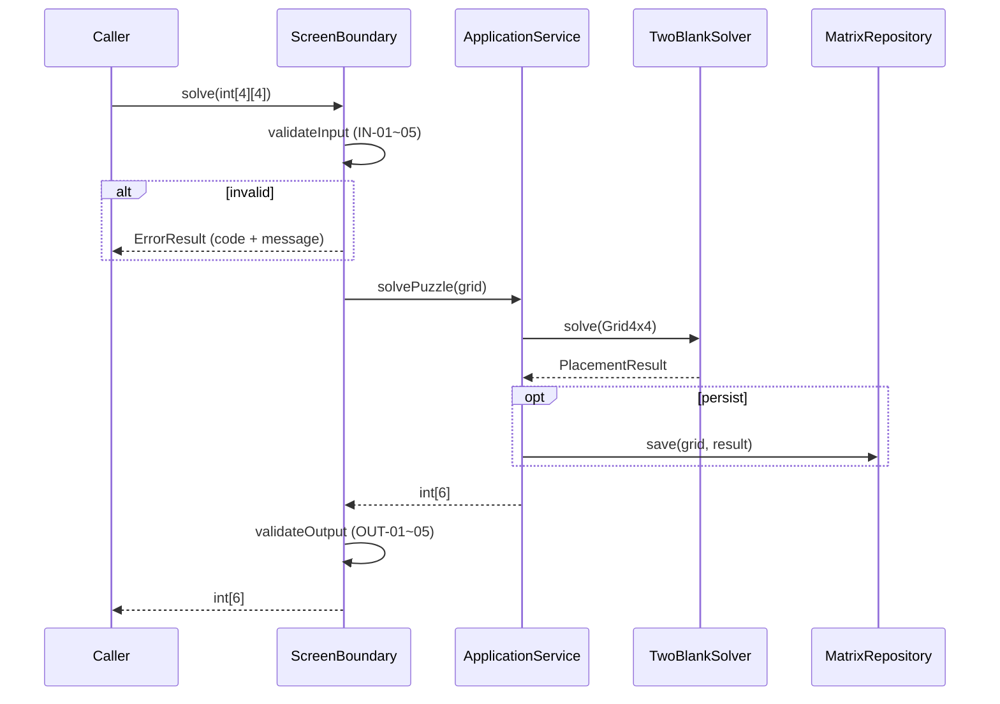

# Magic Square 4×4 — Dual-Track UI + Logic TDD · Clean Architecture 설계

| 항목 | 내용 |
|------|------|
| 프로젝트 | MagicSquare_30 |
| 문서 유형 | 레이어 분리 · 계약 · 테스트 · 통합 계획 (구현 코드 없음) |
| 선행 문서 | `Report/01.MagicSquare_ProblemDefinition_Report.md` |
| 훈련 초점 | 레이어 분리, 계약 기반 테스트, 리팩토링 (알고리즘 난이도 2순위) |
| 작성일 | 2026-05-28 |

---

## 전역 고정 계약 (모든 레이어의 단일 진실)

### 입력 (External → UI Boundary)

| 규칙 ID | 규칙 | 검증 방법 |
|---------|------|-----------|
| IN-01 | `int[4][4]` | `length == 4` && 모든 행 `length == 4` |
| IN-02 | 빈칸 표기 | 값 `0`만 빈칸 |
| IN-03 | 빈칸 개수 | `0`의 개수 **정확히 2** |
| IN-04 | 값 범위 | 각 셀 ∈ `{0} ∪ [1,16]` |
| IN-05 | 중복 | `0`을 제외한 값에 중복 없음 |

### 출력 (UI Boundary → External)

| 규칙 ID | 규칙 | 검증 방법 |
|---------|------|-----------|
| OUT-01 | 타입 | `int[6]` |
| OUT-02 | 좌표 | `r1,c1,r2,c2` ∈ [1,4] |
| OUT-03 | 숫자 | `n1,n2` ∈ [1,16], `n1 ≠ n2` |
| OUT-04 | 순서 규칙 | 누락 숫자 `a<b`일 때, `(E1←a, E2←b)`가 마방진이면 `[r1,c1,a,r2,c2,b]`, 아니면 `[r1,c1,b,r2,c2,a]` |
| OUT-05 | 빈칸 순서 | **E1** = 행 우선(row-major) 스캔에서 **첫 번째** `0`, **E2** = **두 번째** `0` (행 1→4, 열 1→4, 1-index) |

### 빈칸 스캔 알고리즘 (결정적, 공유 정의)

```
for r = 1 to 4
  for c = 1 to 4
    if grid[r-1][c-1] == 0
      append (r,c) to empties
      if empties.size == 2: stop
```

### 마방 상수 (Magic Constant)

- 완성 격자(1~16 각 1회)에서 행·열·주대각선·부대각선 합 = **MC = 34**
- 검사 대상 선(총 10개): 행 4 + 열 4 + 주대각선 1 + 부대각선 1

---

# 1) Logic Layer (Domain Layer) 설계

## 1.1 도메인 개념

| 구분 | 이름 | 책임 (SRP) | 비고 |
|------|------|------------|------|
| **Value Object** | `Grid4x4` | 4×4 정수 배열 보유; 불변; 인덱스 접근만 | UI/DTO와 분리 |
| **Value Object** | `CellPosition` | 1-index `(row, col)`; 동등성 비교 | E1/E2 식별 |
| **Value Object** | `MissingPair` | 누락 숫자 `(smaller, larger)`; 정렬 보장 | 1~16 집합 차집합 |
| **Value Object** | `MagicConstant` | 값 34 고정; 선 합 목표값 제공 | 4×4·1~16 전용 |
| **Value Object** | `LineSum` | 한 선(행/열/대각)의 합 계산 결과 | 부분 격자 허용 |
| **Value Object** | `PlacementResult` | `(r1,c1,n1,r2,c2,n2)` 6-tuple 검증 | OUT-01~05 캡슐 |
| **Domain Service** | `EmptyCellLocator` | row-major로 빈칸 2개 좌표 반환 | IN-03 전제 시 호출 |
| **Domain Service** | `MissingNumberFinder` | 1~16 중 격자에 없는 두 수 반환 | IN-05 전제 |
| **Domain Service** | `MagicSquareValidator` | 완성 격자에 대해 I1·I2(10선) 검사 | I4 준수 |
| **Domain Service** | `TwoBlankSolver` | 두 배치 조합 시도 후 OUT-04에 맞는 `PlacementResult` 선택 | 핵심 유스케이스 |
| **Entity (선택)** | `PuzzleAttempt` | 입력 격자 ID + 시각 + 결과(선택); Data 연동 시 | 학습용, 1차 필수 아님 |

**레이어 규칙:** Domain은 `MatrixRepository`, 콘솔, 파일, JSON을 **참조하지 않음**.

## 1.2 도메인 불변조건 (Invariants)

| ID | 불변조건 | 완성 격자 | 2-빈칸 입력 격자 |
|----|----------|-----------|------------------|
| **D-I1** | 1~16 각각 정확히 1회 | 필수 | 0 제외 값은 집합의 부분집합; 누락 2개는 `MissingPair` |
| **D-I2** | 10개 선의 합 모두 **34** | 필수 | 솔버 결과 격자에만 필수 |
| **D-I3** | Magic Constant MC = 34 | `sum(1..16)/4` | 동일 |
| **D-I4** | “유효 마방진” 판정은 D-I1·D-I2 **전부** 통과 후에만 | 필수 | `MagicSquareValidator`만이 “true” 선언 |
| **D-I5** | 동일 완성 격자 → 동일 판정 | 필수 | 필수 |
| **D-I6** | E1/E2 순서는 row-major 첫·둘째 `0`으로 고정 | — | 솔버·출력 일관성 |
| **D-I7** | OUT-04: 두 조합 중 정확히 하나만 유효할 때만 성공; 둘 다 유효 시 `smaller→E1` 우선 | — | 둘 다 유효 TC는 Domain 예외로 정의(아래) |

**부분 만족 금지:** “행 1만 합 34”는 D-I2 미충족.

## 1.3 핵심 유스케이스 (도메인 관점)

| UC ID | 이름 | 전제 | 결과 | 실패 |
|-------|------|------|------|------|
| **UC-D1** | 빈칸 찾기 | IN-01~03 (UI에서 보장 시 Domain은 2개 가정) | `CellPosition` E1, E2 | 빈칸 ≠ 2 → `InvalidEmptyCount` |
| **UC-D2** | 누락 숫자 찾기 | IN-05 | `MissingPair(a,b), a<b` | 0 제외 15개 미만/초과 → `InvalidOccupiedCount` |
| **UC-D3** | 마방진 판정 | 완성 격자 | `boolean` | — |
| **UC-D4** | 두 조합 시도 | UC-D1,D2 완료 | `PlacementResult` 6-int | 둘 다 무효 → `NoValidPlacement`; 둘 다 유효 → `AmbiguousPlacement` |
| **UC-D5** | 격자에 값 채우기 (내부) | 복사본 격자 | 완성 `Grid4x4` | — |

**UC-D4 상세 (결정적):**

1. `a,b` = 누락 숫자 (`a<b`)
2. `G1` = 입력 복사 후 `E1←a`, `E2←b` → `MagicSquareValidator(G1)`
3. `G2` = 입력 복사 후 `E1←b`, `E2←a` → validator
4. `G1` 유효 → `PlacementResult(E1,a,E2,b)`
5. else `G2` 유효 → `PlacementResult(E1,b,E2,a)`
6. else → `NoValidPlacement`
7. 둘 다 유효 → `AmbiguousPlacement` (입력 오류 또는 비정상 퍼즐; 통합 테스트 1건)

## 1.4 Domain API (내부 계약)

> 표기: 좌표 1-index. 실패는 checked domain exception 또는 `Result` 타입(구현 선택). **본 문서는 예외 ID로 고정.**

### `EmptyCellLocator.locate(grid: Grid4x4) → [CellPosition, CellPosition]`

| 항목 | 내용 |
|------|------|
| 입력 | `Grid4x4` (0 개수 2) |
| 출력 | `[E1, E2]` row-major 순 |
| 실패 | `InvalidEmptyCount` — 0 개수 ≠ 2 |

### `MissingNumberFinder.find(grid: Grid4x4) → MissingPair`

| 항목 | 내용 |
|------|------|
| 입력 | 0 제외 값 14개, 서로 다름, 각 ∈ [1,16] |
| 출력 | `(a,b)` with `a<b`, `{a,b} = {1..16} \ occupied` |
| 실패 | `InvalidOccupiedCount` — 0 제외 개수 ≠ 14 |

### `MagicSquareValidator.isValid(grid: Grid4x4) → boolean`

| 항목 | 내용 |
|------|------|
| 입력 | 0 없음, 모든 값 [1,16] |
| 출력 | `true` iff D-I1 ∧ D-I2 (10선) |
| 실패 | 입력에 0 존재 → `GridNotComplete` |

### `TwoBlankSolver.solve(grid: Grid4x4) → PlacementResult`

| 항목 | 내용 |
|------|------|
| 입력 | UI 계약 통과 격자 (0 정확히 2) |
| 출력 | `toIntArray()` → `int[6]` OUT-01~05 |
| 실패 | `NoValidPlacement`, `AmbiguousPlacement` |

### `PlacementResult.toExternalArray() → int[6]`

| 항목 | 내용 |
|------|------|
| 출력 | `[r1,c1,n1,r2,c2,n2]` |

## 1.5 Domain 단위 테스트 설계 (RED 우선)

### 테스트 명명

`domain_<기능>_<조건>_<기대결과>`

### 정상 케이스

| Test ID | Given (요약) | When | Then | Invariant |
|---------|--------------|------|------|-----------|
| **DT-001** | 알려진 완성 마방진 | `isValid` | `true` | D-I1, D-I2 |
| **DT-002** | 완성 격자에서 임의 2칸을 0으로 (유효 퍼즐) | `solve` | `int[6]` OUT-04 만족 | D-I6, D-I7 |
| **DT-003** | DT-002 결과로 격자 복원 | `isValid` | `true` | D-I4 |
| **DT-004** | row-major: (1,1),(4,4)에 0 | `locate` | E1=(1,1), E2=(4,4) | D-I6 |
| **DT-005** | 1~14만 채움, 누락 {7,12} | `find` | (7,12) | D-I1 |

**DT-002용 고정 격자 (손검증용 알려진 마방진에서 2칸 제거):**

```
[ 0,  3,  2, 13]
[ 5, 10, 11,  8]
[ 9,  6,  7, 12]
[ 4, 15, 14,  0]
```

- 누락: {1,16}
- E1=(1,1), E2=(4,4)
- (E1←1,E2←16) → 완성 후 validator `true` → 기대 `[1,1,1,4,4,16]`

### 비정상 케이스

| Test ID | Given | When | Then | Invariant |
|---------|-------|------|------|-----------|
| **DT-101** | 완성 격자에서 한 칸만 15로 변경 | `isValid` | `false` | D-I2 |
| **DT-102** | 한 행만 합 34, 나머지 깨짐 | `isValid` | `false` | D-I2 (부분 만족) |
| **DT-103** | 0이 3개 | `locate` / `solve` | `InvalidEmptyCount` | — |
| **DT-104** | 0 제외 값 중복 | `find` | (UI 선차단; Domain 직접 호출 시 `InvalidOccupiedCount` 또는 전용) | D-I1 |
| **DT-105** | 2빈칸이나 어떤 배치도 무효 | `solve` | `NoValidPlacement` | D-I7 |
| **DT-106** | 0 없음 | `isValid` on complete | `true`; `solve` | UI에서 차단 권장 | — |

### 엣지 케이스

| Test ID | Given | When | Then | Invariant |
|---------|-------|------|------|-----------|
| **DT-201** | E1,E2 인접 | `solve` | 결정적 6-tuple | D-I5, D-I6 |
| **DT-202** | 누락 (8,9), (9,8) 둘 다 유효인 인위 격자 | `solve` | `AmbiguousPlacement` | D-I7 |
| **DT-203** | 동일 입력 2회 `solve` | 비교 | 배열 동일 | D-I5 |

### RED 작성 순서 (Logic Track)

1. DT-001 (`MagicSquareValidator`)
2. DT-004 (`EmptyCellLocator`)
3. DT-005 (`MissingNumberFinder`)
4. DT-002, DT-003 (`TwoBlankSolver`)
5. DT-101~105 (실패)

---

# 2) Screen Layer (UI Layer) 설계 (Boundary Layer)

> UI = **입력/출력 경계**. 화면·위젯·CSS 없음.

## 2.1 사용자/호출자 관점 시나리오



| Step | 행위 | 책임 레이어 |
|------|------|-------------|
| 1 | `int[4][4]` 전달 | Caller |
| 2 | IN-01~05 검증 | UI |
| 3 | Domain 솔버 호출 | Application (또는 UI→Domain 직접; **의존 방향**: UI → Application → Domain) |
| 4 | OUT 형식 검증 | UI |
| 5 | (선택) 저장 | Application → Data |

## 2.2 UI 계약 (외부 계약)

### Input schema

| 필드 | 타입 | 제약 |
|------|------|------|
| `grid` | `int[4][4]` | IN-01 ~ IN-05 |

### Output schema (성공)

| 필드 | 타입 | 제약 |
|------|------|------|
| `result` | `int[6]` | OUT-01 ~ OUT-05 |

### Error schema

| 필드 | 타입 | 필수 | 설명 |
|------|------|------|------|
| `code` | `string` | Y | 기계 판독용 |
| `message` | `string` | Y | 사람 판독용 (**아래 문구와 바이트 단위 일치**) |
| `field` | `string` | N | `grid` 고정 |

| code | 발생 조건 (IN 규칙) | message (고정 문자열) |
|------|---------------------|------------------------|
| `ERR_GRID_ROWS` | 행 수 ≠ 4 | `Grid must have exactly 4 rows.` |
| `ERR_GRID_COLS` | 어떤 행이든 열 수 ≠ 4 | `Each row must have exactly 4 columns.` |
| `ERR_EMPTY_COUNT` | 0의 개수 ≠ 2 | `Grid must contain exactly 2 empty cells (0).` |
| `ERR_VALUE_RANGE` | 0∉[0]∪[1,16] 위반 | `Cell values must be 0 or between 1 and 16 inclusive.` |
| `ERR_DUPLICATE` | 0 제외 중복 | `Non-zero values must be unique.` |
| `ERR_NO_SOLUTION` | Domain `NoValidPlacement` | `No valid magic square placement exists for the given grid.` |
| `ERR_AMBIGUOUS` | Domain `AmbiguousPlacement` | `Both placements are valid; input is ambiguous.` |
| `ERR_INTERNAL` | OUT 검증 실패(버그) | `Internal error: output contract violated.` |

**Domain 예외 → UI code 매핑 (고정):**

| Domain | UI code |
|--------|---------|
| `NoValidPlacement` | `ERR_NO_SOLUTION` |
| `AmbiguousPlacement` | `ERR_AMBIGUOUS` |

## 2.3 UI 레벨 테스트 (Contract-first, RED 우선)

**원칙:** Domain은 **Mock** (`TwoBlankSolver` / `ApplicationService` 인터페이스). UI 테스트는 **계약만** 검증.

| Test ID | Given | When | Then | Mock |
|---------|-------|------|------|------|
| **UT-001** | 유효 2-빈칸 격자 | `solve` | `int[6]` 길이 6, Mock 반환값 그대로 | `[1,1,1,4,4,16]` 반환 |
| **UT-002** | 행 3개 | `solve` | `ERR_GRID_ROWS` + 고정 message | 호출 없음 |
| **UT-003** | 4×5 | `solve` | `ERR_GRID_COLS` | 호출 없음 |
| **UT-004** | 0이 1개 | `solve` | `ERR_EMPTY_COUNT` | 호출 없음 |
| **UT-005** | 값 17 | `solve` | `ERR_VALUE_RANGE` | 호출 없음 |
| **UT-006** | 3과 3 중복 | `solve` | `ERR_DUPLICATE` | 호출 없음 |
| **UT-007** | Mock `NoValidPlacement` | `solve` | `ERR_NO_SOLUTION` | 예외 throw |
| **UT-008** | Mock 정상 반환 | `solve` | 각 좌표 ∈ [1,4], n1≠n2 | 검증 로직 |
| **UT-009** | Mock이 [0,0,0,0,0,0] 반환 | `solve` | `ERR_INTERNAL` | OUT 검증 실패 |

### RED 순서 (UI Track)

1. UT-002 ~ UT-006 (입력 검증만, Mock 없음)
2. UT-001, UT-008 (성공 경로)
3. UT-007, UT-009 (오류 경로)

## 2.4 UX/출력 규칙

| 규칙 ID | 규칙 |
|---------|------|
| UX-01 | 성공 시 반환값은 **숫자 배열만**; 문자열 포맷 없음 |
| UX-02 | 실패 시 **항상** `code` + `message`; message는 2.2 표와 **완전 일치** |
| UX-03 | 로케일: 영문 고정 (다국어 2차) |
| UX-04 | 좌표는 항상 1-index; 0-index 변환은 UI **금지** (Domain과 동일) |
| UX-05 | Caller에게 Domain 타입(`Grid4x4`) 노출 금지 |

---

# 3) Data Layer 설계

## 3.1 목적 정의

| 항목 | 내용 |
|------|------|
| 목적 | 동일 퍼즐 입력·결과를 **세션 간 재현** (학습: 레이어 교체·테스트 더블) |
| 범위 | 4×4 격자 + (선택) 마지막 `int[6]` 결과 + 타임스탬프 |
| 비범위 | DB, ORM, 동시성, 사용자 계정 |

## 3.2 인터페이스 계약

### `MatrixRepository`

| 메서드 | 입력 | 출력 | 실패 |
|--------|------|------|------|
| `save(sessionId: String, grid: int[4][4], result: int[6] \| null)` | sessionId 비공백; grid IN-01~05; result는 null 또는 OUT-01~05 | void | `StorageWriteFailure` |
| `load(sessionId: String)` | 비공백 id | `StoredSession { grid, result?, savedAt }` | `SessionNotFound` |
| `exists(sessionId: String)` | — | `boolean` | — |
| `delete(sessionId: String)` | — | void | `SessionNotFound` |

### `StoredSession` (DTO)

| 필드 | 타입 | 제약 |
|------|------|------|
| `grid` | `int[4][4]` | 로드 후 IN-01~05 재검증 |
| `result` | `int[6]?` | 있으면 OUT-01~05 |
| `savedAt` | `ISO-8601 string` | UTC |

**의존성:** Data → Domain 타입 **참조 금지** (primitive/DTO만).

## 3.3 구현 옵션 비교

| 항목 | 옵션 A: InMemory | 옵션 B: File (JSON) |
|------|------------------|---------------------|
| 저장소 | `Map<String, StoredSession>` | `{baseDir}/{sessionId}.json` |
| 영속성 | 프로세스 종료 시 소멸 | 디스크 유지 |
| 테스트 속도 | 최고 | I/O 포함, 중간 |
| 형식 오류 | 해당 없음 | 파싱 예외 필요 |
| 학습 목표 | 레이어 경계 | **교체 가능성** 시연에 유리 |

**추천: 옵션 B (File JSON)** — 이유: (1) Repository 교체 TDD 실습, (2) 통합 테스트에서 파일 없음/깨진 JSON 시나리오 명확, (3) InMemory는 테스트 더블로 유지.

파일 스키마 (고정):

```json
{
  "grid": [[...4],[...4],[...4],[...4]],
  "result": [1,1,1,4,4,16],
  "savedAt": "2026-05-28T12:00:00Z"
}
```

## 3.4 Data 레이어 테스트

| Test ID | Given | When | Then |
|---------|-------|------|------|
| **ST-001** | 유효 grid+result | `save` → `load` | grid·result 동일 (셀 단위) |
| **ST-002** | 없는 sessionId | `load` | `SessionNotFound` |
| **ST-003** | 손상 JSON | `load` | `StorageFormatError` |
| **ST-004** | 3×3 JSON | `load` | `StorageFormatError` (행≠4) |
| **ST-005** | `delete` 후 `exists` | | `false` |
| **ST-006** | result null 저장 | `load` | `result == null` |

---

# 4) Integration & Verification

## 4.1 통합 경로 정의

### 레이어 의존성 (Clean Architecture)

```
[ Caller ]
    ↓
[ ScreenBoundary (UI) ]  → validates IN / OUT
    ↓
[ ApplicationService ]   → orchestration, optional transaction
    ↓         ↘
[ Domain ]      [ MatrixRepository (Data) ]
```

| 규칙 | 내용 |
|------|------|
| DEP-01 | Domain은 어떤 외부 레이어도 import하지 않음 |
| DEP-02 | UI는 Data를 **직접** 호출하지 않음 (Application 경유) |
| DEP-03 | Data는 Domain 인터페이스를 구현하지 않음 (DTO만) |
| DEP-04 | 테스트에서 UI↔Domain 결합 테스트 시 UI Mock 해제 → **통합** 스위트로 이동 |

### ApplicationService (선택이나 권장)

| 메서드 | 행위 |
|--------|------|
| `solvePuzzle(grid, sessionId?)` | Domain solve → (sessionId 있으면) Repository save → `int[6]` |

## 4.2 통합 테스트 시나리오

### 정상 (≥2)

| IT ID | 시나리오 | 검증 |
|-------|----------|------|
| **IT-001** | UI→App→Domain, DT-002 격자 | `int[6] == [1,1,1,4,4,16]` |
| **IT-002** | IT-001 + `sessionId="s1"` | 파일 존재, load 시 grid·result 일치 |
| **IT-003** | 알려진 완성 마방진 2칸 제거 (다른 위치) | OUT-04 + 완성 후 10선 합 34 |

### 실패 (≥3)

| IT ID | 시나리오 | 기대 |
|-------|----------|------|
| **IT-101** | 0이 3개 격자 | `ERR_EMPTY_COUNT`, Domain 미호출 |
| **IT-102** | DT-105 무해 격자 | `ERR_NO_SOLUTION` |
| **IT-103** | 존재하지 않는 session load | `SessionNotFound` |
| **IT-104** | 손상 JSON load | `StorageFormatError` |

## 4.3 회귀 보호 규칙

| ID | 규칙 |
|----|------|
| REG-01 | `DT-*`, `UT-*`, `ST-*`, `IT-*` ID 삭제 금지; 변경 시 동일 ID 유지 |
| REG-02 | IN-01~05, OUT-01~05, Error `message` 문자열 변경 시 **버전 태그** 및 전 테스트 일괄 갱신 |
| REG-03 | Domain 공개 API 시그니처 변경 시 UI Mock 인터페이스 동시 갱신 |
| REG-04 | CI에서 Logic 스위트와 UI 스위트 **분리 실행**; 통합은 3번째 job |
| REG-05 | 리팩토링 후 전 스위트 green 없이 merge 금지 |

## 4.4 커버리지 목표

| 레이어 | 목표 | 측정 범위 (제안) |
|--------|------|------------------|
| Domain Logic | **≥ 95%** line | `EmptyCellLocator`, `MissingNumberFinder`, `MagicSquareValidator`, `TwoBlankSolver` |
| UI Boundary | **≥ 85%** line | 입력 검증, 오류 매핑, OUT 검증, Application 호출 분기 |
| Data | **≥ 80%** line | `FileMatrixRepository` (InMemory는 테스트 더블, 커버리지 제외) |

**미달 시:** 해당 레이어에 **계약 미커버 분기** 테스트 추가 (구현 전 설계에 TC ID 부여).

## 4.5 Traceability Matrix (필수)

| Concept (Invariant) | Rule | Use Case | Contract | Test | Component |
|---------------------|------|----------|----------|------|-----------|
| D-I1 | IN-05, D-I1 | UC-D2 | `MissingNumberFinder.find` | DT-005, UT-006 | MissingNumberFinder |
| D-I2 | MC=34, 10선 | UC-D3 | `MagicSquareValidator.isValid` | DT-001, DT-101, DT-102 | MagicSquareValidator |
| D-I4 | 전체 검사 후 true | UC-D3 | validator | DT-001, DT-103 | MagicSquareValidator |
| D-I5 | 동일 입력 동일 출력 | UC-D4 | `TwoBlankSolver.solve` | DT-203, UT-001 | TwoBlankSolver |
| D-I6 | row-major E1,E2 | UC-D1 | `EmptyCellLocator.locate` | DT-004 | EmptyCellLocator |
| D-I7 | OUT-04 배치 규칙 | UC-D4 | `PlacementResult`, OUT-04 | DT-002, DT-003, IT-001 | TwoBlankSolver |
| IN-01 | 4행 | — | Input schema | UT-002 | ScreenBoundary |
| IN-02 | 4열 | — | Input schema | UT-003 | ScreenBoundary |
| IN-03 | 0×2 | UC-D1 | Input schema | UT-004, IT-101 | ScreenBoundary |
| IN-04 | 0∪[1,16] | — | Input schema | UT-005 | ScreenBoundary |
| OUT-01~03 | int[6], 좌표, 숫자 | UC-D4 | Output schema | UT-008, UT-009 | ScreenBoundary |
| OUT-04 | a→E1 우선 | UC-D4 | `solve` output | DT-002, IT-001 | TwoBlankSolver + ScreenBoundary |
| OUT-05 | 6-tuple 순서 | UC-D4 | `toExternalArray` | IT-001 | PlacementResult |
| 저장 정합성 | JSON schema | save/load | `MatrixRepository` | ST-001, IT-002 | FileMatrixRepository |
| ERR 메시지 | UX-02 | — | Error schema | UT-002~007 | ScreenBoundary |

---

## 부록 A — 10선 합 검사 정의 (Domain 공유)

| 선 ID | 셀 (1-index) |
|-------|----------------|
| R1~R4 | 행 i, 열 1~4 |
| C1~C4 | 열 j, 행 1~4 |
| D1 | (1,1)(2,2)(3,3)(4,4) |
| D2 | (1,4)(2,3)(3,2)(4,1) |

각 선 합 == 34 이면 해당 선 통과; **10개 모두** 통과 시 D-I2 충족.

## 부록 B — Definition of Done (설계 단계)

- [x] Logic / UI / Data / Integration 4절 구조 완비
- [x] IN·OUT·Error 계약 수치/문구 고정
- [x] Domain·UI·Data·통합 테스트 ID 부여
- [x] Traceability Matrix 작성
- [ ] 구현 코드 없음 (본 문서 준수)

## 부록 C — 선행 문제 정의와의 관계

| 기존 (01 보고서) | 본 설계 |
|------------------|---------|
| I1, I2 | D-I1, D-I2로 구체화 (2-빈칸 + 완성 판정) |
| 검증만 1차 | **2-빈칸 채우기(솔버)** 가 1차 유스케이스; 완성 판정은 하위 UC-D3 |
| 입출력 미정 | IN-01~05, OUT-01~05 고정 |

---

*문서 끝 — 구현·테스트 코드는 다음 단계(TDD RED)에서 별도 산출.*
