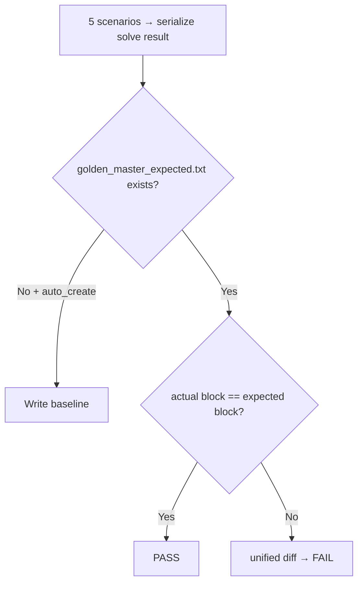

# MagicSquare — Golden Master GM-1 / GM-2 Regression Report

| 항목 | 내용 |
|------|------|
| 프로젝트 | MagicSquare_37 |
| 문서 유형 | Golden Master(Approval) 회귀 테스트 구축 보고서 |
| 작성일 | 2026-05-29 |
| 범위 | GM-1 기준 파일 · GM-2 pytest 회귀 · approve 패턴 · contract 보호 |
| 관련 문서 | `docs/golden_master_approve_pattern.md`, `docs/golden_master_execution_example.md`, `Report/02.MagicSquare_DualTrack_CleanArchitecture_Design.md` |
| Transcript | `Prompt/12.MagicSquare_Golden_Master_GM02_Transcript.md` |

---

## 1. Executive Summary

본 세션에서는 Magic Square Solver의 **end-to-end Boundary 출력**을 고정하는 **Golden Master 회귀 안전장치**를 구축했다.

- **GM-1:** 실제 `ScreenBoundary.solve()` 출력을 `tests/golden_master_expected.txt`에 기록하고 approve 패턴(bootstrap / compare / unified diff)을 적용했다.
- **GM-2:** `@pytest.mark.golden_master` 마킹된 5개 시나리오 테스트(`GM-TC-01`~`GM-TC-05`)와 contract assertion(int[6], 1-index, row-major, small-first, reverse fallback, Error Contract)을 추가했다.
- **Boundary 보완:** `duplicate_number` 시나리오가 `no_valid_solution`과 구분되도록 `ERR_DUPLICATE` 검증을 `screen_boundary.py`에 추가했다.
- **문서:** `README.md` Golden Master 체크리스트(GM-01~GM-10), approve 설계 문서, 실행 예시를 반영했다.

최종 검증: **`pytest -m golden_master -v` → 5 passed**, 전체 **`67 passed`**.

---

## 2. 배경 및 목표

| 목표 | 상태 |
|------|------|
| REFACTOR 전 회귀 기준선(baseline) 확보 | 완료 |
| 정상 / reverse / 오류 5 시나리오 고정 | 완료 |
| approve 패턴 (없으면 생성, 있으면 diff) | 완료 |
| pytest 마커 `golden_master` | 완료 |
| README GM-01~GM-10 체크리스트 | 완료 |
| 기준 파일 버전 관리 포함 | 완료 |

**타이밍 정책 (README):** Refactoring 시작 전 구축 · GREEN 완료 후 즉시 적용.

---

## 3. 시나리오 매트릭스 (GM-TC)

| Test ID | Section | 입력 요약 | 기대 결과 | Contract 검증 |
|---------|---------|-----------|-----------|---------------|
| **GM-TC-01** | `normal_success` | G0 기반 small-first 성공 격자 | `[2, 4, 8, 4, 3, 14]` | small-first placement |
| **GM-TC-02** | `reverse_success` | small-first 실패 → reverse 성공 | `[3, 3, 6, 4, 4, 1]` | reverse fallback |
| **GM-TC-03** | `invalid_blank_count` | 0이 3개 | `ERR_EMPTY_COUNT` | Error DTO code |
| **GM-TC-04** | `duplicate_number` | non-zero 중복 | `ERR_DUPLICATE` | Error DTO code |
| **GM-TC-05** | `no_valid_solution` | 두 조합 모두 무효 | `ERR_NO_SOLUTION` | Error DTO code |

시나리오 격자: `tests/golden_master/scenarios.py`  
Contract helper: `tests/golden_master/contract.py`

---

## 4. 산출물 목록

### 4.1 기준 파일 · 스크립트

| 경로 | 설명 |
|------|------|
| `tests/golden_master_expected.txt` | 커밋된 Golden Master baseline (652 bytes) |
| `scripts/generate_golden_master.py` | baseline 생성/갱신 CLI |

### 4.2 테스트 · 헬퍼

| 경로 | 설명 |
|------|------|
| `tests/golden_master/test_golden_master_magic_square.py` | GM-TC-01~05, `@pytest.mark.golden_master` |
| `tests/golden_master/approve.py` | approve / unified diff / 시나리오 블록 추출 |
| `tests/golden_master/contract.py` | int[6], 1-index, row-major, placement, error contract |
| `tests/golden_master/scenarios.py` | 5 시나리오 SSOT |
| `tests/golden_master/conftest.py` | pytest path bootstrap |

### 4.3 프로덕션 (Boundary)

| 경로 | 설명 |
|------|------|
| `src/magic_square/boundary/duplicate.py` | `ERR_DUPLICATE` 상수 |
| `src/magic_square/boundary/screen_boundary.py` | empty count 이후 duplicate 검증 추가 |

### 4.4 문서 · 설정

| 경로 | 설명 |
|------|------|
| `docs/golden_master_approve_pattern.md` | approve 패턴 설계 (GM-1/GM-2) |
| `docs/golden_master_execution_example.md` | `pytest -m golden_master -v` 실행 예시 |
| `README.md` | `## Golden Master 회귀 안전장치` (GM-01~GM-10) |
| `pyproject.toml` | `golden_master` pytest marker 등록 |

---

## 5. Approve 패턴



| 모드 | 트리거 | 동작 |
|------|--------|------|
| Bootstrap | `approve(auto_create=True)` + 파일 없음 | 현재 출력으로 baseline 생성 |
| CI Verify | `test_gm_tc_*` (`auto_create=False`) | 바이트 단위 비교, drift 시 FAIL |
| Refresh | `python scripts/generate_golden_master.py` | 의도적 변경 후 baseline 갱신 |

실패 시 출력 형식:

```text
--- expected
+++ actual
@@ line diff @@
```

---

## 6. 테스트 실행 결과

### 6.1 Golden Master only

```text
pytest -m golden_master -v
→ 5 passed, 62 deselected (2026-05-29)
```

### 6.2 전체 회귀

```text
pytest tests/ -q
→ 67 passed (2026-05-29)
```

### 6.3 노드 ID 참조

```text
tests/golden_master/test_golden_master_magic_square.py::TestGoldenMasterMagicSquare::test_gm_tc_01_normal_success
tests/golden_master/test_golden_master_magic_square.py::TestGoldenMasterMagicSquare::test_gm_tc_02_reverse_success
tests/golden_master/test_golden_master_magic_square.py::TestGoldenMasterMagicSquare::test_gm_tc_03_invalid_blank_count
tests/golden_master/test_golden_master_magic_square.py::TestGoldenMasterMagicSquare::test_gm_tc_04_duplicate_number
tests/golden_master/test_golden_master_magic_square.py::TestGoldenMasterMagicSquare::test_gm_tc_05_no_valid_magic_square
```

---

## 7. README 체크리스트 (GM-01~GM-10)

| ID | 항목 | 상태 |
|----|------|------|
| GM-01 | `golden_master_expected.txt` 생성 | ✅ |
| GM-02 | 정상/역순/오류 시나리오 추가 | ✅ |
| GM-03 | `git add tests/golden_master_expected.txt` | ✅ |
| GM-04 | `test_golden_master_magic_square` 작성 | ✅ |
| GM-05 | approve 패턴 적용 | ✅ |
| GM-06 | Golden Master 테스트 PASS 확인 | ✅ |
| GM-07 | row-major 규칙 보호 | ✅ |
| GM-08 | 1-index 출력 보호 | ✅ |
| GM-09 | reverse 조합 fallback 보호 | ✅ |
| GM-10 | Error Contract 보호 | ✅ |

---

## 8. 설계 정합

| 설계 항목 | Report/02 · PRD | 본 GM 구현 |
|-----------|-----------------|------------|
| 성공 출력 `int[6]` | OUT-01~OUT-05 | `assert_int_six_tuple` |
| 1-index 좌표 | FR-05 | `assert_one_index_coordinates` |
| row-major blank 순서 | FR-02 | `assert_row_major_blank_order` |
| small-first → reverse | FR-05 / AC-13 | GM-TC-01, GM-TC-02 |
| `ERR_EMPTY_COUNT` | AC-FR-01-03 | GM-TC-03 |
| `ERR_DUPLICATE` | AC-FR-01-05 | GM-TC-04 (+ Boundary 구현) |
| `ERR_NO_SOLUTION` | AC-FR-01-14 | GM-TC-05 |

---

## 9. Decision / Out of Scope

| 항목 | 결정 |
|------|------|
| 캡처 방식 | stdout 대신 **Boundary DTO serialization** (`FailureResult.code` / `list[int]`) |
| 실패 message 바이트 | Track A contract 테스트에 위임; GM은 **code**만 baseline |
| UI(PyQt) stdout | GM 범위 외 |

---

## 10. 다음 단계 (권장)

1. REFACTOR 시 `pytest -m golden_master -v` 를 선행 게이트로 실행
2. 의도적 계약 변경 시 generator로 baseline 갱신 후 diff 리뷰
3. AC-FR-01-02~05 Track A GREEN 확대 시 GM 시나리오 추가 검토

---

## 문서 이력

| 버전 | 날짜 | 내용 |
|------|------|------|
| 1.0 | 2026-05-29 | GM-1/GM-2 Golden Master 구축 보고서 최초 작성 |
