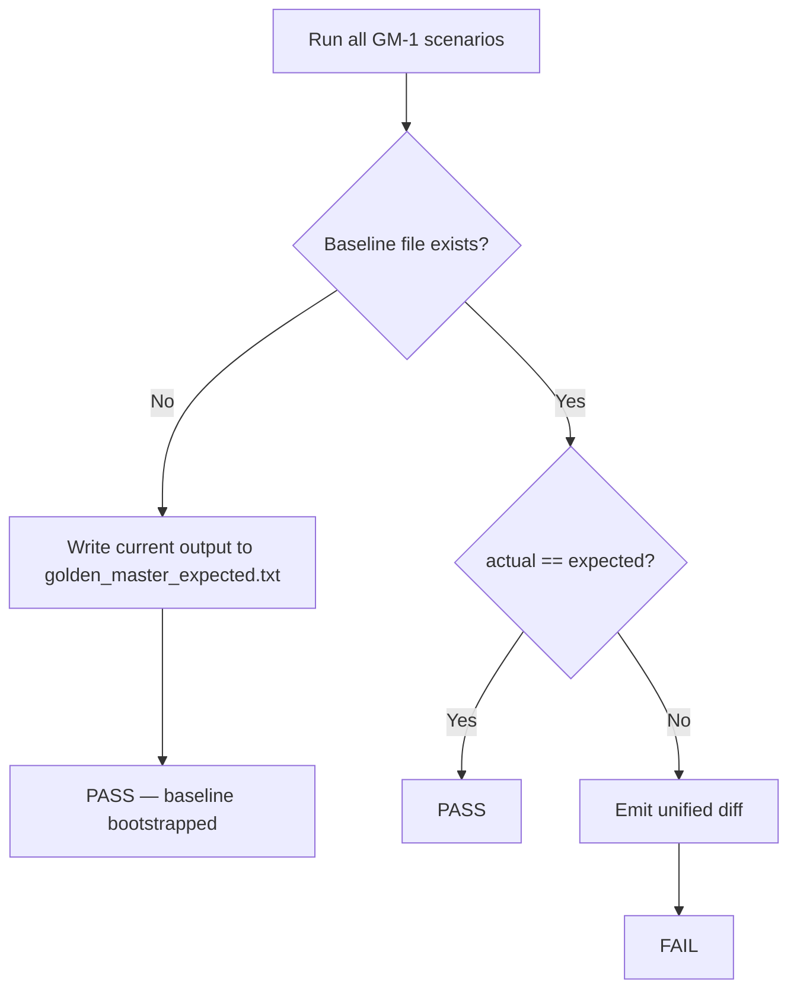

# Golden Master Approve Pattern (GM-1 / GM-2)

| Field | Value |
|---|---|
| **Document ID** | GM-2 |
| **Version** | 1.1 |
| **Date** | 2026-05-29 |
| **Baseline file** | `tests/golden_master_expected.txt` |
| **Generator** | `scripts/generate_golden_master.py` |
| **Test entry** | `tests/golden_master/test_golden_master_magic_square.py` |
| **Marker** | `@pytest.mark.golden_master` |
| **Run** | `pytest -m golden_master -v` |

---

## 1. Purpose

GM-1 locks the **end-to-end Boundary solve contract** for five representative
scenarios. The committed baseline captures actual `ScreenBoundary.solve` output
(serialized from the `FailureResult` DTO or the success `list[int]` tuple) so
future refactors cannot change user-visible behavior without an explicit review.

## 2. Scenarios

| Test ID | Section | Scenario | Grid source | Expected kind |
|---|---|---|---|---|
| GM-TC-01 | `normal_success` | small-first placement succeeds | `NORMAL_SUCCESS_GRID` | `Output: [int×6]` |
| GM-TC-02 | `reverse_success` | small-first fails, reverse succeeds | `REVERSE_SUCCESS_GRID` | `Output: [int×6]` |
| GM-TC-03 | `invalid_blank_count` | empty-cell count ≠ 2 | `THREE_EMPTY_CELLS_GRID` | `Error: ERR_EMPTY_COUNT` |
| GM-TC-04 | `duplicate_number` | non-zero duplicate values | `DUPLICATE_GRID` | `Error: ERR_DUPLICATE` |
| GM-TC-05 | `no_valid_solution` | both placements invalid | `NO_SOLUTION_GRID` | `Error: ERR_NO_SOLUTION` |

Scenario grids live in `tests/golden_master/scenarios.py`.
Contract assertions live in `tests/golden_master/contract.py`.

## 3. Baseline file structure

Each section uses the same block shape:

```text
[scenario_name]
Input:
<row1>
<row2>
<row3>
<row4>
Output:
[int list]
________________________________________

[scenario_name]
Input:
...
Error:
<ERR_CODE>
________________________________________
```

- Rows are space-separated integers.
- Success paths serialize the six-int placement tuple exactly as Python would
  render a `list[int]`.
- Failure paths serialize only the machine-readable `code` field from
  `FailureResult` (message text is covered by Track A contract tests).

## 4. Approve pattern

Implementation: `tests/golden_master/approve.py`



| Mode | Trigger | Behavior |
|---|---|---|
| **Bootstrap** | `approve(auto_create=True)` and file missing | Write current output, do not fail |
| **Verify** | `test_golden_master_matches_solver_output` | `auto_create=False`; compare bytes |
| **Refresh** | `python scripts/generate_golden_master.py` | Overwrite baseline after intentional change |

On mismatch, pytest raises `AssertionError` with a `difflib.unified_diff` between
the committed baseline and the live solver output.

## 5. Workflow

### Initial creation

```bash
python scripts/generate_golden_master.py
git add tests/golden_master_expected.txt
```

### After an intentional contract change

1. Implement the change.
2. Re-run the generator and inspect the diff.
3. Commit the updated baseline together with the code change.
4. Run `pytest tests/golden_master/test_golden_master.py`.

### CI gate

```bash
pytest tests/golden_master/test_golden_master.py
```

The test must run with `auto_create=False` so missing or stale baselines fail
the build instead of silently rewriting history.

## 6. Traceability

| Concept | Test ID | Artifact |
|---|---|---|
| GM-2 regression | `TestGoldenMasterMagicSquare::test_gm_tc_01` … `test_gm_tc_05` | `golden_master_expected.txt` |
| int[6] / 1-index / row-major | GM-TC-01, GM-TC-02 | `contract.py` |
| small-first rule | GM-TC-01 | `assert_small_first_placement` |
| reverse fallback | GM-TC-02 | `assert_reverse_fallback_placement` |
| FR-01 empty count | GM-TC-03 | `ERR_EMPTY_COUNT` |
| FR-01 duplicate | GM-TC-04 | `ERR_DUPLICATE` |
| FR-05 no solution | GM-TC-05 | `ERR_NO_SOLUTION` |

See also `docs/golden_master_execution_example.md` for sample `pytest -m golden_master -v` output.

## 7. Out of scope

- UI stdout rendering (GM-1 uses Boundary DTO serialization, not PyQt capture).
- Message-string byte identity (covered by `tests/boundary/` Track A tests).
- Performance or solver-algorithm optimization checks.
